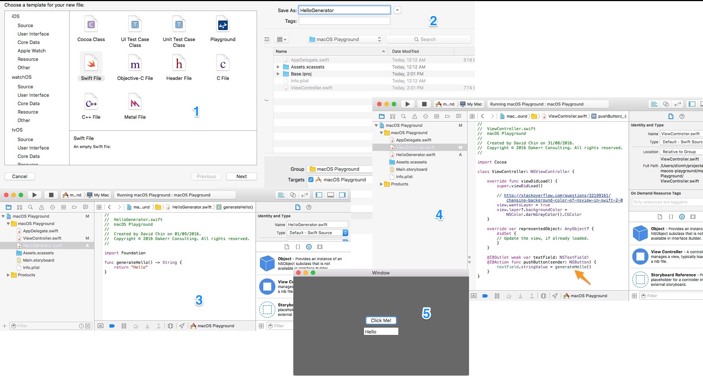

# Create Model File

Create the model layer in a separate file, creat a function in there, and use it in the view controller filer.

[Click for full size](https://raw.githubusercontent.com/dlcmh/macos-playground/create-model-file/docs/create-model-file.jpg)

