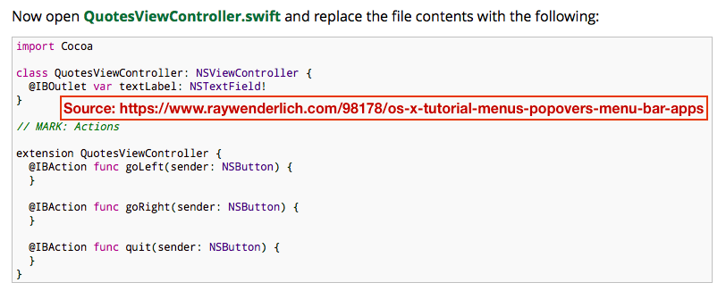

# IBAction inside a View Controller Extension

Reference: [OS X Tutorial: Menus and Popovers in Menu Bar Apps](https://www.raywenderlich.com/98178/os-x-tutorial-menus-popovers-menu-bar-apps)

[Click for full size](https://raw.githubusercontent.com/dlcmh/macos-playground/ibaction-inside-view-controller-extension/docs/2.png)

The 'Click Me!' Push Button is linked to an `IBAction` function declared inside a `ViewController` extension block.

The `IBOutlet` for the Text Field needs to live in the class declaration. Declaring it in the Extension block results in the error: "Extensions may not contain stored properties".
