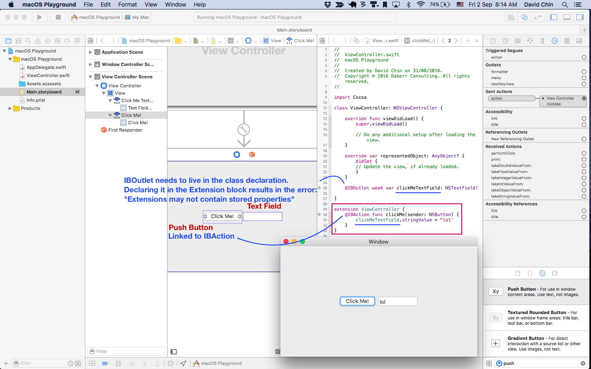

# Background Color of View via the use of an Extension

References:

-  http://stackoverflow.com/questions/27890144/setting-backgroundcolor-of-custom-nsview/31214403
- https://github.com/JohnSundell/SwiftKit/blob/master/Source/OSX/NSView%2BSwiftKit.swift

[Click for full size](https://raw.githubusercontent.com/dlcmh/macos-playground/background-color-with-layer-via-extension/docs/1.png)

[Click for full size](https://raw.githubusercontent.com/dlcmh/macos-playground/background-color-with-layer-via-extension/docs/2.png)

[Click for full size](https://raw.githubusercontent.com/dlcmh/macos-playground/background-color-with-layer-via-extension/docs/3.png)

[Click for full size](https://raw.githubusercontent.com/dlcmh/macos-playground/background-color-with-layer-via-extension/docs/5.png)

[Click for full size](https://raw.githubusercontent.com/dlcmh/macos-playground/background-color-with-layer-via-extension/docs/6.png)

